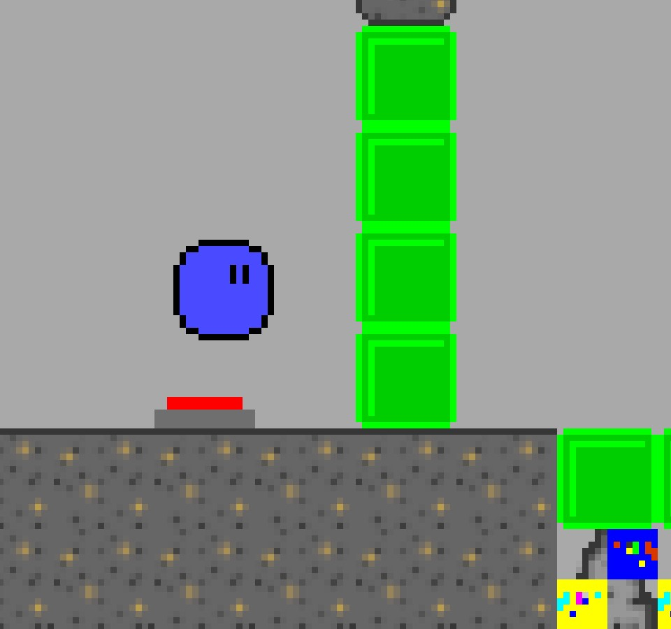

## A Totally Generic Platformer

"A Totally Generic Platformer" is a totally generic platformer. It's just a generic, average platformer with nothing special. You have been warned.

## A Code Jam
This game was created as part of the Python Discord Summer Code Jam 2022. In this competition, individuals are randomly allocated 4 other teammates and given just over a week to make something that fits a theme.

This year, the theme was "It's not a bug, it's a feature".

Submissions also had to incorporate WebSockets, using one of [these frameworks](https://www.pythondiscord.com/events/code-jams/9/frameworks/). We chose to use [`websockets`](https://github.com/aaugustin/websockets) to facilitate multiplayer.

The game was written in Python (obviously, it's a Python code jam...) using [`pygame`](https://github.com/pygame/pygame).

Find out more about the competition [here](https://www.pythondiscord.com/events/code-jams/9/).

## Installation

### Quick Installation

To play the game, simply download the package you need from [the latest release](https://github.com/smileyface12349/old-fashioned-orcs/releases/latest), then run the executable.

### Manual Installation

1. [Clone](https://docs.github.com/en/repositories/creating-and-managing-repositories/cloning-a-repository) this repository
```bash
cd where/you/want/it
git clone https://github.com/smileyface12349/old-fashioned-orcs.git
```
2. Make sure you have [Python](https://www.python.org/downloads/) installed (version 3.10+).
3. Install the required dependencies:

```bash
cd where/you/want/it/old-fashioned-orcs
python3 -m pip install -r dev-requirements.txt
```

4. Then simply run the [\_\_init\_\_.py](__init__.py) file.


## Controls

- `←` and `→` to move right/left (WASD and ZQSD control schemes are supported as well).
- `↑` or `Space Bar` to jump (WASD and ZQSD supported here as well).
- `R` if you experience a "pseudo-crash".
- `F` for the pause menu (to skip levels or mute the music).
- `Return` or `Space Bar` to proceed dialogue.
- `ESC` key while playing will take you back to the menu, a second hit will exit the game.

## Screenshots

Our game is really cool I promise

   <br>   

## Hints

Stuck while playing the game? Try jumping around at random until something works. In the unlikely event that doesn't work, here's a few hints to help you out.

### Level 1

This level should be pretty self-explanatory

### Level 2

If you can't do this one, it's probably because you need two people! If you're on your own, press F and skip the level.

### Level 3

<details>
<summary>Hint 1</summary>
Have you picked up the shovel (you have to approach it from the side - where your hands would be if you had any)
</details>

<details>
<summary>Hint 2</summary>
If you can't get back by going left, try going right first.
</details>

<details>
<summary>Hint 3</summary>
You have a shovel now. What does a shovel do?
</details>

### Level 4

<details>
<summary>Hint 1</summary>

</details>

<details>
<summary>Hint 2</summary>
The bricks below you have the same pattern as the blocks you need to jump on
</details>

### Level 5

This is a co-op only level, so if you're on your own then it's time to press F!

### Endings

It's not possible to skip this part of the game, so you have to actually be able to do it!

There's a few different endings to the game. All start on level 6.

#### Surface Ending

This level is very self-explanatory - begin by climbing up to the surface

#### Cave Ending

You need some good platforming skills to get this ending! There's also a secondary ending in this path that you may want to look out for.

[NOTE: Due to the way it works internally, if you press F to go back a level it will take you to the surface ending. Simply press F again to get back to level 6]

#### Secret Ending

<details>
<summary>Hint 1</summary>
Did you notice any blue boxes on the way to the cave ending?
</details>

<details>
<summary>Hint 2</summary>
You really think I'm going to tell you how to do it? It wouldn't exactly be a secret ending then!
</details>

## The Old-Fashioned Orcs

"A Totally Generic Platformer" was created by:
 - smileyface12349
 - Spacewiki
 - Nasty
 - Paulchen
 - Staubfinger
